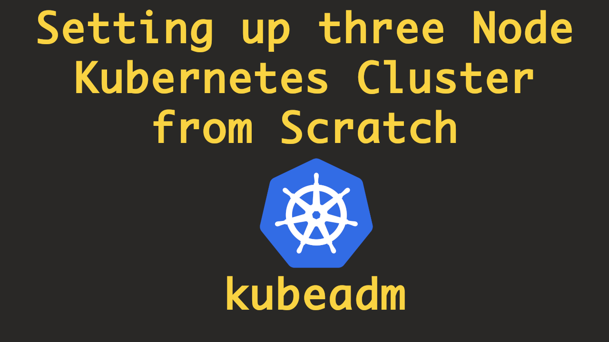
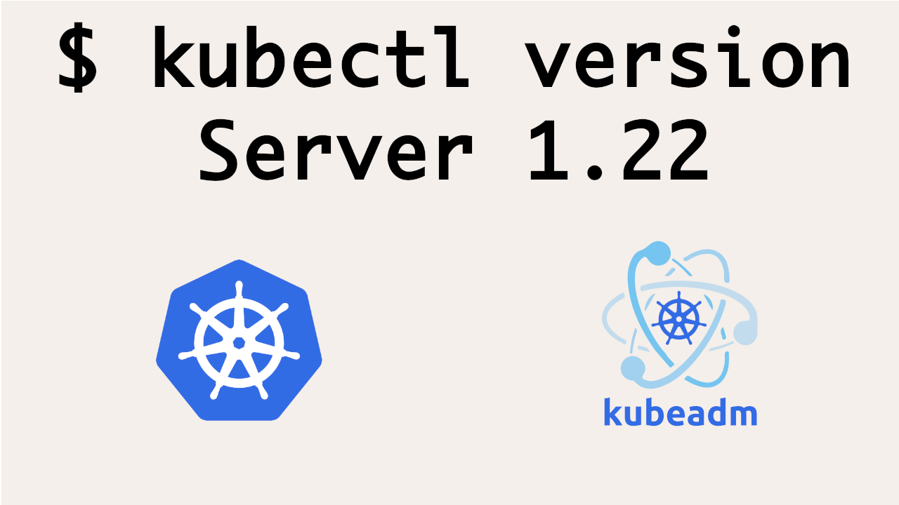

<!-- [](https://youtu.be/HoQFPkEzgfQ) -->

<a href="https://youtu.be/shGDqYenoos"><center><br></center></a>
<br>
## Setting up three node Kubernetes cluster

First of all, we should have three instances created that can connect over the public network. It doesn't matter how those instances are created, for example, they can either be Digital Ocean `droplets` or `AWS EC2` instances.

### SSH into all the instances

Once you are into those instances, the commands that are mentioned below should be run on all the instances

#### Commands to run on all the nodes

```
# update packages and their version
apt-get update && apt-get upgrade -y

# install curl and apt-transport-https
sudo apt-get update && sudo apt-get install -y apt-transport-https curl

# add key to verify releases
curl -s https://packages.cloud.google.com/apt/doc/apt-key.gpg | sudo apt-key add -

# add kubernetes apt repo
cat <<EOF | sudo tee /etc/apt/sources.list.d/kubernetes.list
deb https://apt.kubernetes.io/ kubernetes-xenial main
EOF

# install kubelet, kubeadm and kubectl
sudo apt-get update
sudo apt-get install -y kubelet kubeadm kubectl

# install docker
apt-get install docker.io

# apt-mark hold is used so that these packages will not be updated/removed automatically
sudo apt-mark hold kubelet kubeadm kubectl
```

After the above commands are successfully run on all the worker nodes. Below steps can be followed to initialize the Kubernetes cluster.

### On Leader Node

Run the below command on the node that you want to make the leader node. Please make sure you replace the correct IP of the node with `IP-of-Node`

```
export MASTER_IP=<IP-of-Node>
kubeadm init --apiserver-advertise-address=${MASTER_IP} --pod-network-cidr=10.244.0.0/16
```

### Configure docker's cgroup driver

There are chances that the `kubeadm init` command is going to fail saying the different cgroup drvers are being used in the kubelet (`systemd`) and docker (`cgroupfs`)
service. To resolve that we will make sure that both the services are running with the same cgroup driver.
It's recommended that we use `systemd` as cgroup driver for both of the services. To restart docker with `systemd` as cgroup driver, change the
service file (`/lib/systemd/system/docker.service`) for docker to accept cgroup driver


```
ExecStart=/usr/bin/dockerd -H fd:// --containerd=/run/containerd/containerd.sock --exec-opt native.cgroupdriver=systemd
```

and then restart the docker service

```
# reload unit/config files
systemctl daemon-reload
# restart docker service
systemctl restart docker
```

You will have to do this on all the other instances as well.


#### Join worker nodes to the Leader node

Once the command `kubeadm init` is completed on the leader node, below we would get a command like below in the output of `kubeadm init` that can be run on worker nodes to make them join the leader node.

```
kubeadm join 206.189.134.39:6443 --token dxxfoj.a2zzwbfrjejzir4h \
    --discovery-token-ca-cert-hash sha256:110e853989c2401b1e54aef6e8ff0393e05f18d531a75ed107cf6c05ca4170eb
```

### Install CNI plugin

The below command can be run on the leader node to install the CNI plugin

```
kubectl apply -f https://raw.githubusercontent.com/coreos/flannel/master/Documentation/kube-flannel.yml
```

### Setting up Kubeconfig file

After successful completion of `kubeadm init` command, like we got the `kubeadm join` command, we would also get details about how we can set up `kubeconfig` file.


